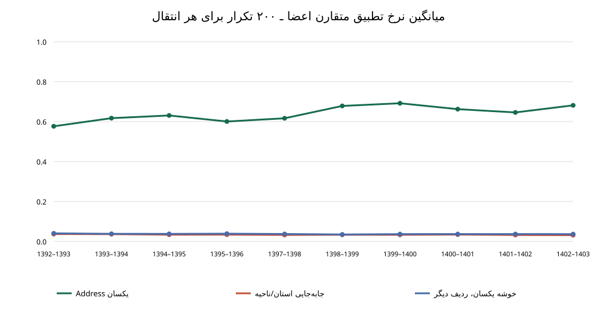

# گزارش نهایی اعتبارسنجی پنل سه‌موجی، ۱۳۹۲–۱۴۰۳

## دامنه، کلید و قاعده‌های پیش‌اعلام‌شده

۱۲ فایل خام Access برای سال‌های ۱۳۹۲ تا ۱۴۰۳ مستقیماً خوانده شد. هر سال جدول خانوار، جدول P1 اعضا و جدول‌های طراحی موجود استخراج شد. در ۱۳۹۴ و ۱۳۹۵ چهار جدول کمکی R/U فقط شامل Address و MahMorajeh بودند؛ همهٔ Addressها و MahMorajeh آن‌ها عیناً با جدول Data همان سال منطبق بود و متغیر طراحی تازه‌ای اضافه نمی‌کردند (`raw_access_auxiliary_design_table_check.csv`). Address به‌صورت رشتهٔ خام حفظ شد؛ کلید فقط `دورهٔ طراحی + Address خام` است. هیچ پیوندی میان ۱۳۹۶ و ۱۳۹۷ ساخته نشده است. دادهٔ پاک‌شدهٔ HBSIR برای ساخت کلید استفاده نشد.

دورهٔ طراحی اول ۱۳۹۲–۱۳۹۶ و دورهٔ دوم ۱۳۹۷–۱۴۰۳ است. هشت cohort سه‌موجی در جدول پایین جداگانه سنجیده شده‌اند. در تمام سال‌ها Address درون‌سالی یکتا بود و مقدار خالی نداشت.

پیش از مشاهدهٔ نتایج، سطح ۱ را با تداوم متقارن حداقل ۷۵٪ در هر یک از دو فاصله، مسیر سرپرست پذیرفتنی یا تغییر سرپرست قابل توضیح تعریف کردم. سطح ۲ همان قاعدهٔ جمعیت‌شناختی را با حداقل ۵۰٪ در هر فاصله به کار می‌برد. سطح ۳ همهٔ Addressهای سه‌موجی با وضعیت اصلی/جایگزین قابل طبقه‌بندی را نگه می‌دارد و فیلتر جمعیت‌شناختی ندارد. این‌ها طبقه‌بندی‌های ممیزی‌اند، نه پنل تأییدشده.

## دسترسی و تکرار Address

| سال | ردیف خانوار Access | ردیف اعضا | Address یکتا | ردیف تکراری | شهری | روستایی |
| --- | --- | --- | --- | --- | --- | --- |
| 1392 | 39864 | 140359 | 39864 | 0 | 19764 | 20100 |
| 1393 | 39856 | 139033 | 39856 | 0 | 19756 | 20100 |
| 1394 | 39857 | 137616 | 39857 | 0 | 19758 | 20099 |
| 1395 | 39864 | 135552 | 39864 | 0 | 19764 | 20100 |
| 1396 | 37962 | 134389 | 37962 | 0 | 18701 | 19261 |
| 1397 | 38960 | 135830 | 38960 | 0 | 20350 | 18610 |
| 1398 | 38328 | 132541 | 38328 | 0 | 19898 | 18430 |
| 1399 | 37557 | 128955 | 37557 | 0 | 19306 | 18251 |
| 1400 | 37988 | 128914 | 37988 | 0 | 19618 | 18370 |
| 1401 | 37951 | 126478 | 37951 | 0 | 19567 | 18384 |
| 1402 | 37883 | 123857 | 37883 | 0 | 19640 | 18243 |
| 1403 | 37505 | 121118 | 37505 | 0 | 19347 | 18158 |

| دوره طراحی | حضور در چند سال | تعداد Address |
| --- | --- | --- |
| Frame_1392_1396 | 1 | 50252 |
| Frame_1392_1396 | 2 | 33458 |
| Frame_1392_1396 | 3 | 26745 |
| Frame_1397_1403 | 1 | 77103 |
| Frame_1397_1403 | 2 | 43578 |
| Frame_1397_1403 | 3 | 33971 |

در دورهٔ اول 1,341 Address و در دورهٔ دوم 2,467 Address بعد از وقفه بازگشته‌اند. این موارد متوازن نیستند و جدا نگه داشته شده‌اند.

## اندازهٔ cohortها و سه سطح پیشنهادی

| Cohort | A | B | C | B / N₁ | B / (N₁/3) | جنس سرپرست ثابت | مسیر سن سازگار | هر دو شرط | تغییر سرپرست توضیح‌پذیر | میانه تداوم اعضا | B ≥۵۰٪ | B ≥۷۵٪ | B <۲۵٪ | L1 | L2 | L3 |
| --- | --- | --- | --- | --- | --- | --- | --- | --- | --- | --- | --- | --- | --- | --- | --- | --- |
| 1392_1394 | 9344 | 6710 | 7884 | 16.8% | 50.5% | 94.8% | 69.7% | 68.7% | 1.6% | 66.7% | 71.7% | 47.7% | 17.3% | 3122 | 4295 | 7884 |
| 1393_1395 | 8871 | 6167 | 7219 | 15.5% | 46.4% | 94.8% | 71.8% | 70.7% | 1.9% | 75.0% | 73.1% | 51.1% | 16.6% | 3064 | 4096 | 7219 |
| 1394_1396 | 8530 | 5782 | 7038 | 14.5% | 43.5% | 95.2% | 72.6% | 71.5% | 2.1% | 75.0% | 74.4% | 51.0% | 15.0% | 2875 | 3896 | 7038 |
| 1397_1399 | 7297 | 5981 | 6845 | 15.4% | 46.1% | 95.1% | 75.0% | 74.0% | 1.8% | 75.0% | 78.7% | 58.1% | 13.7% | 3384 | 4273 | 6845 |
| 1398_1400 | 7068 | 5773 | 6490 | 15.1% | 45.2% | 95.7% | 77.6% | 76.6% | 1.7% | 83.3% | 80.6% | 62.8% | 12.2% | 3538 | 4298 | 6490 |
| 1399_1401 | 6504 | 5283 | 5956 | 14.1% | 42.2% | 95.7% | 77.1% | 76.0% | 1.5% | 80.0% | 79.2% | 61.7% | 13.2% | 3183 | 3882 | 5956 |
| 1400_1402 | 6485 | 5266 | 5880 | 13.9% | 41.6% | 95.5% | 74.8% | 73.5% | 1.7% | 80.0% | 76.6% | 58.2% | 14.9% | 3008 | 3707 | 5880 |
| 1401_1403 | 6617 | 5385 | 5950 | 14.2% | 42.6% | 95.5% | 74.2% | 73.0% | 1.3% | 80.0% | 77.3% | 59.3% | 15.0% | 3130 | 3803 | 5950 |

در کل هشت cohort، 46,347 نامزد B، 25,304 در سطح ۱، 32,250 در سطح ۲ و 53,262 در سطح ۳ قرار گرفتند. شناسه‌های مشترک بین cohortها در `cohort_overlap_integrity.csv` ممیزی شده‌اند؛ برای هر دوره تعداد کلیدهای واقع‌شده در چند cohort 0 بود.

B تعریف شده است به‌صورت Takmil=1 در هر سه موج؛ مقدار Jaygozin خالی برای این موارد خالی باقی می‌ماند و به «خیر» تبدیل نشده است. C به معنی پاسخ وضعیت اصلی روشن است (Takmil=1)، یا Takmil=2 همراه با کد صریح ۱/۲ برای پاسخ جایگزین؛ ترکیب‌های ناقص/متناقض در C وارد نشده‌اند.

## سرپرست و ترکیب اعضا

در نمونهٔ B، 789 مشاهدهٔ cohort دارای دست‌کم یک تغییر سرپرست بودند که با تطبیق یک عضو قبلی (همسر یا فرزند) به سرپرست موج بعد قابل توضیح شد. این شمارش مشاهده در سطح cohort است؛ خانواری که در cohortهای متفاوت باشد می‌تواند بیش از یک بار شمرده شود. ناسازگاری به‌تنهایی حذف ایجاد نکرد.

میانهٔ تداوم متقارن roster در cohortهای B به‌طور میانه 77.5% بود. برای هر cohort سهم B با تداوم دست‌کم ۵۰٪، ۷۵٪ و کمتر از ۲۵٪ در جدول آمده است. تطبیق اعضا حداکثر تعداد یک‌به‌یک را با جنس، سن مطابق فاصلهٔ سال‌ها و رابطهٔ یکسان/قابل‌توضیح بیشینه می‌کند.

## نمونه‌های بهترین و ضعیف‌ترین پیوند

برای هر cohort صد مورد برتر و صد مورد ضعیف‌تر از نمونهٔ B بر اساس امتیاز متوازنِ ازپیش‌تعریف‌شده انتخاب شد. جزئیات هر عضو در سه سال، فقط با رابطه، جنس، سن و شمارهٔ عضو، در `panel_link_extreme_cases.parquet` (Drive) است. جدول زیر ۱۰۰ مورد ضعیف هر cohort را با پرچم‌های تشخیصی خلاصه می‌کند. پرچم‌ها هم‌پوشان‌اند و علت قطعی یا حکم فردی نیستند: «سن بیرون از قاعده» یعنی مسیر سنی خارج از بازهٔ مجاز، بدون انتقال سرپرست قابل‌تشخیص؛ تطبیق زیر ۲۵٪ نشانگر تغییر شدید roster است؛ وضعیت جایگزین/مبهم در B عمدتاً ریسکِ تعارض کد است چون B بر Takmil=1 بنا شده است.

| cohort | N | میانه امتیاز | میانه تداوم اعضا | تغییر سرپرست قابل توضیح | سن بیرون از قاعده | تغییر جنس بدون انتقال | شماره عضو مانع تطبیق | تداوم اعضا زیر ۲۵٪ | جایگزین/وضعیت مبهم | بدون پرچم تشخیصی |
| --- | --- | --- | --- | --- | --- | --- | --- | --- | --- | --- |
| 1392_1394 | 100 | 0.000 | 0.0% | 3.0% | 100.0% | 100.0% | 18.0% | 99.0% | 0.0% | 0.0% |
| 1393_1395 | 100 | 0.026 | 0.0% | 6.0% | 100.0% | 100.0% | 24.0% | 99.0% | 0.0% | 0.0% |
| 1394_1396 | 100 | 0.096 | 0.0% | 3.0% | 100.0% | 100.0% | 31.0% | 86.0% | 0.0% | 0.0% |
| 1397_1399 | 100 | 0.056 | 0.0% | 5.0% | 100.0% | 100.0% | 23.0% | 93.0% | 0.0% | 0.0% |
| 1398_1400 | 100 | 0.083 | 0.0% | 4.0% | 100.0% | 100.0% | 13.0% | 89.0% | 0.0% | 0.0% |
| 1399_1401 | 100 | 0.083 | 0.0% | 3.0% | 100.0% | 100.0% | 21.0% | 90.0% | 0.0% | 0.0% |
| 1400_1402 | 100 | 0.111 | 0.0% | 4.0% | 100.0% | 100.0% | 20.0% | 92.0% | 0.0% | 0.0% |
| 1401_1403 | 100 | 0.083 | 0.0% | 3.0% | 100.0% | 100.0% | 15.0% | 89.0% | 0.0% | 0.0% |

قید شمارهٔ عضو از تطبیق جمعیت‌شناختیِ بدون آن جدا سنجیده شد. جدول پایین نشان می‌دهد در هر گذار چه مقدار از matchها با این قید باقی می‌مانند و در چند درصد خانوارها شمارهٔ عضو باعث از دست‌رفتن تطبیق شده است.

| cohort | t | t+1 | N | تداوم roster بدون شماره | تداوم roster با شماره | خانوار دارای افت تطبیق |
| --- | --- | --- | --- | --- | --- | --- |
| 1392_1394 | 1392 | 1393 | 6710 | 80.0% | 75.0% | 13.9% |
| 1392_1394 | 1393 | 1394 | 6710 | 100.0% | 85.7% | 12.6% |
| 1393_1395 | 1393 | 1394 | 6167 | 100.0% | 83.3% | 12.7% |
| 1393_1395 | 1394 | 1395 | 6167 | 100.0% | 100.0% | 12.5% |
| 1394_1396 | 1394 | 1395 | 5782 | 100.0% | 100.0% | 12.7% |
| 1394_1396 | 1395 | 1396 | 5782 | 100.0% | 100.0% | 12.2% |
| 1397_1399 | 1397 | 1398 | 5981 | 100.0% | 100.0% | 10.0% |
| 1397_1399 | 1398 | 1399 | 5981 | 100.0% | 100.0% | 8.0% |
| 1398_1400 | 1398 | 1399 | 5773 | 100.0% | 100.0% | 8.1% |
| 1398_1400 | 1399 | 1400 | 5773 | 100.0% | 100.0% | 7.7% |
| 1399_1401 | 1399 | 1400 | 5283 | 100.0% | 100.0% | 7.4% |
| 1399_1401 | 1400 | 1401 | 5283 | 100.0% | 100.0% | 7.2% |
| 1400_1402 | 1400 | 1401 | 5266 | 100.0% | 100.0% | 7.7% |
| 1400_1402 | 1401 | 1402 | 5266 | 100.0% | 100.0% | 7.7% |
| 1401_1403 | 1401 | 1402 | 5385 | 100.0% | 100.0% | 7.4% |
| 1401_1403 | 1402 | 1403 | 5385 | 100.0% | 100.0% | 6.1% |

تفاوت پاسخ اصلی و جایگزین در جدول زیر آمده است. درصدها روی جفت Addressهای تکرارشده در cohortها محاسبه شده‌اند؛ جایگزینی می‌تواند تغییر ترکیب واقعی خانوار باشد و به‌خودی‌خود خطای Address نیست.

در تجمیع همهٔ cohortها، میانگین تداوم متقارن برای اصلی→اصلی 77.2% و برای جفت‌هایی که دست‌کم یک سوی آن‌ها جایگزین بود 7.1% بود؛ اختلاف اصلی→اصلی منهای جفت جایگزین 70.0% واحد درصد است. این مقایسه توصیفی است و با انتخاب نمونهٔ B سازگار است اگر اختلاف مثبت و روشن باشد.

| از | به | N | جنس سرپرست ثابت | سن در مسیر زمان | تغییر توضیح‌پذیر | میانه roster | roster≥۵۰٪ | roster≥۷۵٪ |
| --- | --- | --- | --- | --- | --- | --- | --- | --- |
| Ambiguous | Ambiguous | 2119 | 67.3% | 25.2% | 14 | 0.0% | 25.7% | 19.2% |
| Ambiguous | No_Completed_Interview | 93 | 0.0% | 0.0% | 0 | — | 0.0% | 0.0% |
| Ambiguous | Original | 3458 | 79.1% | 57.8% | 26 | 83.3% | 58.4% | 49.4% |
| Ambiguous | Substitute | 820 | 63.4% | 6.7% | 2 | 0.0% | 4.6% | 2.3% |
| No_Completed_Interview | Ambiguous | 169 | 0.0% | 0.0% | 0 | — | 0.0% | 0.0% |
| No_Completed_Interview | No_Completed_Interview | 400 | 0.0% | 0.0% | 0 | — | 0.0% | 0.0% |
| No_Completed_Interview | Original | 389 | 0.0% | 0.0% | 0 | — | 0.0% | 0.0% |
| No_Completed_Interview | Substitute | 118 | 0.0% | 0.0% | 0 | — | 0.0% | 0.0% |
| Original | Ambiguous | 4958 | 72.0% | 12.0% | 87 | 0.0% | 11.3% | 7.2% |
| Original | No_Completed_Interview | 346 | 0.0% | 0.0% | 0 | — | 0.0% | 0.0% |
| Original | Original | 101602 | 97.0% | 82.7% | 903 | 100.0% | 84.1% | 68.7% |
| Original | Substitute | 6454 | 77.4% | 5.9% | 54 | 0.0% | 2.9% | 1.2% |
| Substitute | Ambiguous | 59 | 76.3% | 11.9% | 0 | 0.0% | 8.5% | 6.8% |
| Substitute | Original | 229 | 84.3% | 40.2% | 1 | 0.0% | 35.4% | 30.1% |
| Substitute | Substitute | 218 | 82.1% | 35.3% | 2 | 0.0% | 35.8% | 28.0% |

| از | به | N | جنس سرپرست ثابت | سن در مسیر زمان | تغییر توضیح‌پذیر | میانه roster | roster≥۵۰٪ | roster≥۷۵٪ |
| --- | --- | --- | --- | --- | --- | --- | --- | --- |
| Ambiguous | Ambiguous | 89 | 0.0% | 0.0% | 0 | — | 0.0% | 0.0% |
| Ambiguous | No_Completed_Interview | 11 | 0.0% | 0.0% | 0 | — | 0.0% | 0.0% |
| Ambiguous | Original | 113 | 0.0% | 0.0% | 0 | — | 0.0% | 0.0% |
| No_Completed_Interview | Ambiguous | 21 | 0.0% | 0.0% | 0 | — | 0.0% | 0.0% |
| No_Completed_Interview | No_Completed_Interview | 93 | 0.0% | 0.0% | 0 | — | 0.0% | 0.0% |
| No_Completed_Interview | Original | 75 | 0.0% | 0.0% | 0 | — | 0.0% | 0.0% |
| Original | Ambiguous | 772 | 67.2% | 7.5% | 13 | 0.0% | 7.6% | 4.0% |
| Original | No_Completed_Interview | 93 | 0.0% | 0.0% | 0 | — | 0.0% | 0.0% |
| Original | Original | 8068 | 96.4% | 78.5% | 82 | 80.0% | 79.2% | 59.8% |
| Substitute | Original | 9 | 44.4% | 22.2% | 0 | 0.0% | 22.2% | 11.1% |
| Ambiguous | Ambiguous | 266 | 48.9% | 13.9% | 1 | 0.0% | 14.3% | 9.0% |
| Ambiguous | No_Completed_Interview | 17 | 0.0% | 0.0% | 0 | — | 0.0% | 0.0% |
| Ambiguous | Original | 418 | 76.1% | 56.7% | 2 | 83.3% | 56.9% | 49.3% |
| Ambiguous | Substitute | 181 | 61.3% | 7.2% | 0 | 0.0% | 3.9% | 1.7% |
| No_Completed_Interview | Ambiguous | 28 | 0.0% | 0.0% | 0 | — | 0.0% | 0.0% |
| No_Completed_Interview | No_Completed_Interview | 82 | 0.0% | 0.0% | 0 | — | 0.0% | 0.0% |
| No_Completed_Interview | Original | 42 | 0.0% | 0.0% | 0 | — | 0.0% | 0.0% |
| No_Completed_Interview | Substitute | 45 | 0.0% | 0.0% | 0 | — | 0.0% | 0.0% |
| Original | Ambiguous | 449 | 63.0% | 9.1% | 9 | 0.0% | 8.7% | 5.3% |
| Original | No_Completed_Interview | 58 | 0.0% | 0.0% | 0 | — | 0.0% | 0.0% |
| Original | Original | 6836 | 97.3% | 81.2% | 43 | 100.0% | 82.4% | 65.1% |
| Original | Substitute | 922 | 77.2% | 6.2% | 8 | 0.0% | 2.4% | 1.3% |
| Ambiguous | Ambiguous | 224 | 49.6% | 12.5% | 3 | 0.0% | 10.3% | 5.4% |
| Ambiguous | No_Completed_Interview | 22 | 0.0% | 0.0% | 0 | — | 0.0% | 0.0% |
| Ambiguous | Original | 416 | 70.7% | 51.2% | 0 | 87.5% | 52.6% | 44.5% |
| No_Completed_Interview | Ambiguous | 52 | 0.0% | 0.0% | 0 | — | 0.0% | 0.0% |
| No_Completed_Interview | No_Completed_Interview | 105 | 0.0% | 0.0% | 0 | — | 0.0% | 0.0% |
| No_Completed_Interview | Original | 89 | 0.0% | 0.0% | 0 | — | 0.0% | 0.0% |
| Original | Ambiguous | 565 | 65.5% | 9.2% | 5 | 0.0% | 8.1% | 4.4% |
| Original | No_Completed_Interview | 64 | 0.0% | 0.0% | 0 | — | 0.0% | 0.0% |
| Original | Original | 7334 | 96.4% | 79.2% | 83 | 85.7% | 80.4% | 63.3% |
| Ambiguous | Ambiguous | 290 | 54.1% | 14.1% | 1 | 0.0% | 13.1% | 7.9% |
| Ambiguous | No_Completed_Interview | 24 | 0.0% | 0.0% | 0 | — | 0.0% | 0.0% |
| Ambiguous | Original | 390 | 77.2% | 51.8% | 2 | 75.0% | 53.1% | 41.5% |
| Ambiguous | Substitute | 137 | 54.0% | 3.6% | 0 | 0.0% | 2.2% | 0.7% |
| No_Completed_Interview | Ambiguous | 26 | 0.0% | 0.0% | 0 | — | 0.0% | 0.0% |
| No_Completed_Interview | No_Completed_Interview | 94 | 0.0% | 0.0% | 0 | — | 0.0% | 0.0% |
| No_Completed_Interview | Original | 42 | 0.0% | 0.0% | 0 | — | 0.0% | 0.0% |
| No_Completed_Interview | Substitute | 29 | 0.0% | 0.0% | 0 | — | 0.0% | 0.0% |
| Original | Ambiguous | 411 | 64.0% | 11.7% | 3 | 0.0% | 10.2% | 6.8% |
| Original | No_Completed_Interview | 78 | 0.0% | 0.0% | 0 | — | 0.0% | 0.0% |
| Original | Original | 6537 | 97.0% | 83.4% | 57 | 100.0% | 84.0% | 67.8% |
| Original | Substitute | 813 | 78.5% | 6.2% | 9 | 0.0% | 2.7% | 1.1% |
| Ambiguous | Ambiguous | 206 | 67.0% | 15.5% | 1 | 0.0% | 15.0% | 9.2% |
| Ambiguous | No_Completed_Interview | 19 | 0.0% | 0.0% | 0 | — | 0.0% | 0.0% |
| Ambiguous | Original | 408 | 70.8% | 52.9% | 2 | 100.0% | 53.4% | 46.6% |
| Ambiguous | Substitute | 32 | 40.6% | 9.4% | 0 | 0.0% | 6.2% | 3.1% |
| No_Completed_Interview | Ambiguous | 25 | 0.0% | 0.0% | 0 | — | 0.0% | 0.0% |
| No_Completed_Interview | No_Completed_Interview | 26 | 0.0% | 0.0% | 0 | — | 0.0% | 0.0% |
| No_Completed_Interview | Original | 84 | 0.0% | 0.0% | 0 | — | 0.0% | 0.0% |
| No_Completed_Interview | Substitute | 20 | 0.0% | 0.0% | 0 | — | 0.0% | 0.0% |
| Original | Ambiguous | 485 | 66.6% | 8.0% | 9 | 0.0% | 8.0% | 4.3% |
| Original | No_Completed_Interview | 53 | 0.0% | 0.0% | 0 | — | 0.0% | 0.0% |
| Original | Original | 6881 | 97.0% | 82.2% | 64 | 100.0% | 83.1% | 66.3% |
| Original | Substitute | 291 | 77.7% | 7.6% | 1 | 0.0% | 3.1% | 1.4% |
| Ambiguous | Ambiguous | 165 | 71.5% | 14.5% | 4 | 0.0% | 16.4% | 9.1% |
| Ambiguous | Original | 379 | 78.4% | 54.9% | 3 | 80.0% | 55.9% | 45.9% |
| Ambiguous | Substitute | 172 | 57.6% | 4.1% | 1 | 0.0% | 2.9% | 1.7% |
| No_Completed_Interview | Ambiguous | 17 | 0.0% | 0.0% | 0 | — | 0.0% | 0.0% |
| No_Completed_Interview | Original | 57 | 0.0% | 0.0% | 0 | — | 0.0% | 0.0% |
| No_Completed_Interview | Substitute | 24 | 0.0% | 0.0% | 0 | — | 0.0% | 0.0% |
| Original | Ambiguous | 328 | 75.6% | 11.3% | 8 | 0.0% | 9.8% | 4.6% |
| Original | Original | 6130 | 97.3% | 82.9% | 69 | 100.0% | 84.0% | 66.4% |
| Original | Substitute | 915 | 78.4% | 4.8% | 8 | 0.0% | 2.2% | 0.5% |
| Substitute | Ambiguous | 53 | 75.5% | 9.4% | 0 | 0.0% | 7.5% | 5.7% |
| Substitute | Original | 150 | 87.3% | 46.0% | 1 | 20.0% | 40.7% | 34.7% |
| Substitute | Substitute | 140 | 82.1% | 30.0% | 1 | 0.0% | 30.7% | 23.6% |
| Original | Ambiguous | 332 | 83.1% | 10.5% | 7 | 0.0% | 10.5% | 7.2% |
| Original | Original | 6878 | 96.5% | 80.7% | 79 | 100.0% | 83.2% | 66.9% |
| Original | Substitute | 87 | 73.6% | 6.9% | 2 | 0.0% | 0.0% | 0.0% |
| Ambiguous | Ambiguous | 69 | 89.9% | 27.5% | 0 | 0.0% | 29.0% | 17.4% |
| Ambiguous | Original | 186 | 97.3% | 80.6% | 2 | 100.0% | 80.1% | 67.7% |
| Ambiguous | Substitute | 77 | 75.3% | 13.0% | 0 | 0.0% | 13.0% | 7.8% |
| Original | Ambiguous | 119 | 80.7% | 11.8% | 3 | 0.0% | 12.6% | 6.7% |
| Original | Original | 5981 | 97.3% | 86.2% | 47 | 100.0% | 88.1% | 74.1% |
| Original | Substitute | 778 | 74.6% | 6.7% | 7 | 0.0% | 2.8% | 1.3% |
| Substitute | Ambiguous | 1 | 100.0% | 0.0% | 0 | 0.0% | 0.0% | 0.0% |
| Substitute | Original | 44 | 86.4% | 36.4% | 0 | 0.0% | 31.8% | 27.3% |
| Substitute | Substitute | 42 | 76.2% | 40.5% | 0 | 15.5% | 40.5% | 31.0% |
| Ambiguous | Ambiguous | 70 | 92.9% | 40.0% | 1 | 20.0% | 41.4% | 21.4% |
| Ambiguous | Original | 156 | 93.6% | 72.4% | 2 | 100.0% | 73.1% | 62.8% |
| Original | Ambiguous | 181 | 80.1% | 14.4% | 4 | 0.0% | 13.3% | 8.8% |
| Original | Original | 6594 | 97.0% | 84.0% | 61 | 100.0% | 86.2% | 72.6% |
| Original | Substitute | 67 | 76.1% | 6.0% | 0 | 0.0% | 3.0% | 1.5% |
| Ambiguous | Ambiguous | 70 | 90.0% | 30.0% | 0 | 0.0% | 34.3% | 27.1% |
| Ambiguous | Original | 125 | 91.2% | 72.8% | 3 | 80.0% | 71.2% | 59.2% |
| Ambiguous | Substitute | 56 | 80.4% | 8.9% | 0 | 0.0% | 5.4% | 0.0% |
| Original | Ambiguous | 183 | 80.3% | 13.7% | 6 | 0.0% | 15.8% | 9.8% |
| Original | Original | 5884 | 97.5% | 86.7% | 53 | 100.0% | 88.1% | 74.8% |
| Original | Substitute | 683 | 76.9% | 6.3% | 4 | 0.0% | 3.5% | 1.8% |
| Substitute | Ambiguous | 5 | 80.0% | 40.0% | 0 | 14.3% | 20.0% | 20.0% |
| Substitute | Original | 26 | 76.9% | 19.2% | 0 | 0.0% | 15.4% | 15.4% |
| Substitute | Substitute | 36 | 88.9% | 50.0% | 1 | 50.0% | 50.0% | 41.7% |
| Ambiguous | Ambiguous | 66 | 83.3% | 25.8% | 0 | 8.3% | 28.8% | 21.2% |
| Ambiguous | Original | 125 | 96.8% | 79.2% | 0 | 100.0% | 75.2% | 65.6% |
| Original | Ambiguous | 197 | 78.2% | 12.7% | 7 | 0.0% | 14.7% | 9.1% |
| Original | Original | 6116 | 97.4% | 85.6% | 47 | 100.0% | 86.4% | 72.5% |
| Ambiguous | Ambiguous | 76 | 85.5% | 38.2% | 0 | 22.5% | 40.8% | 35.5% |
| Ambiguous | Original | 132 | 90.2% | 65.9% | 2 | 100.0% | 68.2% | 59.8% |
| Ambiguous | Substitute | 55 | 80.0% | 9.1% | 1 | 0.0% | 5.5% | 3.6% |
| Original | Ambiguous | 178 | 82.0% | 20.2% | 3 | 0.0% | 16.9% | 12.9% |
| Original | Original | 5371 | 97.4% | 85.0% | 40 | 100.0% | 86.4% | 73.0% |
| Original | Substitute | 692 | 80.9% | 6.1% | 6 | 0.0% | 3.0% | 1.3% |
| Ambiguous | Ambiguous | 91 | 89.0% | 44.0% | 0 | 25.0% | 46.2% | 37.4% |
| Ambiguous | Original | 134 | 92.5% | 70.9% | 3 | 100.0% | 74.6% | 62.7% |
| Original | Ambiguous | 232 | 83.6% | 18.5% | 1 | 0.0% | 14.2% | 8.2% |
| Original | Original | 6028 | 97.1% | 82.9% | 49 | 100.0% | 84.2% | 70.0% |
| Ambiguous | Ambiguous | 120 | 86.7% | 47.5% | 2 | 37.5% | 50.0% | 41.7% |
| Ambiguous | Original | 150 | 89.3% | 60.0% | 3 | 70.8% | 62.0% | 50.0% |
| Ambiguous | Substitute | 53 | 75.5% | 5.7% | 0 | 0.0% | 3.8% | 1.9% |
| Original | Ambiguous | 173 | 82.7% | 22.0% | 3 | 0.0% | 19.7% | 16.2% |
| Original | Original | 5363 | 97.3% | 82.8% | 49 | 100.0% | 84.4% | 70.4% |
| Original | Substitute | 626 | 74.1% | 5.9% | 4 | 0.0% | 3.7% | 2.2% |
| Ambiguous | Ambiguous | 155 | 88.4% | 49.7% | 1 | 50.0% | 51.6% | 44.5% |
| Ambiguous | Original | 187 | 94.1% | 61.5% | 2 | 80.0% | 62.0% | 54.0% |
| Original | Ambiguous | 203 | 75.4% | 23.2% | 3 | 0.0% | 20.2% | 15.3% |
| Original | Original | 6072 | 96.8% | 80.4% | 46 | 100.0% | 82.2% | 67.7% |
| Ambiguous | Ambiguous | 162 | 87.0% | 51.9% | 0 | 50.0% | 50.6% | 45.1% |
| Ambiguous | Original | 139 | 87.8% | 59.7% | 0 | 75.0% | 59.0% | 51.8% |
| Ambiguous | Substitute | 57 | 63.2% | 7.0% | 0 | 0.0% | 5.3% | 3.5% |
| Original | Ambiguous | 150 | 72.0% | 20.7% | 3 | 0.0% | 21.3% | 17.3% |
| Original | Original | 5529 | 97.6% | 85.0% | 34 | 100.0% | 87.0% | 74.2% |
| Original | Substitute | 580 | 78.6% | 4.3% | 5 | 0.0% | 3.6% | 0.7% |

## عدم پاسخ موج میانی

برای هر cohort، Addressهای حاضر در موج اول و سوم ولی غایب در موج میانی جدا شدند؛ تعداد کل این پیوندهای بازگشتی 52 است. مشخصات پاسخ و سازگاری موج اول–سوم در `middlewave_absence_returns.parquet` (Drive) و خلاصه در `middlewave_nonresponse_summary.csv` ثبت شده است. این موارد در نمونهٔ متوازن A/B/C وارد نشده‌اند.

| cohort | نوع پاسخ t | نوع پاسخ t+2 | N | تداوم roster | جنس سرپرست ثابت | سن سازگار |
| --- | --- | --- | --- | --- | --- | --- |
| 1392_1394 | Substitute | Ambiguous | 13 | 0.0% | 46.2% | 0.0% |
| 1392_1394 | Substitute | No_Completed_Interview | 4 | — | 0.0% | 0.0% |
| 1392_1394 | Substitute | Original | 129 | 0.0% | 79.1% | 8.5% |
| 1392_1394 | Substitute | Substitute | 49 | 0.0% | 85.7% | 16.3% |
| 1393_1395 | Substitute | Ambiguous | 11 | 0.0% | 81.8% | 0.0% |
| 1393_1395 | Substitute | No_Completed_Interview | 5 | — | 0.0% | 0.0% |
| 1393_1395 | Substitute | Original | 149 | 0.0% | 77.2% | 10.7% |
| 1393_1395 | Substitute | Substitute | 51 | 0.0% | 84.3% | 19.6% |
| 1394_1396 | Substitute | Ambiguous | 54 | 0.0% | 90.7% | 5.6% |
| 1394_1396 | Substitute | Original | 500 | 0.0% | 84.0% | 27.8% |
| 1394_1396 | Substitute | Substitute | 376 | 0.0% | 83.0% | 29.8% |
| 1397_1399 | Original | Ambiguous | 7 | 0.0% | 57.1% | 0.0% |
| 1397_1399 | Original | Original | 140 | 33.3% | 91.4% | 45.7% |
| 1397_1399 | Original | Substitute | 101 | 0.0% | 69.3% | 6.9% |
| 1397_1399 | Substitute | Ambiguous | 7 | 0.0% | 85.7% | 28.6% |
| 1397_1399 | Substitute | Original | 115 | 0.0% | 75.7% | 2.6% |
| 1397_1399 | Substitute | Substitute | 94 | 0.0% | 74.5% | 14.9% |
| 1398_1400 | Ambiguous | Ambiguous | 1 | 0.0% | 100.0% | 0.0% |
| 1398_1400 | Ambiguous | Original | 4 | 8.3% | 75.0% | 25.0% |
| 1398_1400 | Ambiguous | Substitute | 8 | 0.0% | 62.5% | 0.0% |
| 1398_1400 | Original | Ambiguous | 12 | 0.0% | 91.7% | 16.7% |
| 1398_1400 | Original | Original | 144 | 33.3% | 92.4% | 53.5% |
| 1398_1400 | Original | Substitute | 121 | 0.0% | 78.5% | 8.3% |
| 1398_1400 | Substitute | Ambiguous | 6 | 0.0% | 100.0% | 0.0% |
| 1398_1400 | Substitute | Original | 123 | 0.0% | 75.6% | 8.9% |
| 1398_1400 | Substitute | Substitute | 66 | 0.0% | 77.3% | 21.2% |
| 1399_1401 | Ambiguous | Ambiguous | 3 | 25.0% | 100.0% | 0.0% |
| 1399_1401 | Ambiguous | Original | 1 | 0.0% | 100.0% | 0.0% |
| 1399_1401 | Ambiguous | Substitute | 7 | 0.0% | 57.1% | 0.0% |
| 1399_1401 | Original | Ambiguous | 13 | 0.0% | 84.6% | 0.0% |
| 1399_1401 | Original | Original | 87 | 50.0% | 93.1% | 50.6% |
| 1399_1401 | Original | Substitute | 70 | 0.0% | 85.7% | 2.9% |
| 1399_1401 | Substitute | Ambiguous | 9 | 0.0% | 66.7% | 0.0% |
| 1399_1401 | Substitute | Original | 165 | 0.0% | 78.2% | 4.8% |
| 1399_1401 | Substitute | Substitute | 96 | 0.0% | 82.3% | 16.7% |
| 1400_1402 | Ambiguous | Original | 4 | 50.0% | 100.0% | 50.0% |
| 1400_1402 | Ambiguous | Substitute | 2 | 0.0% | 100.0% | 0.0% |
| 1400_1402 | Original | Ambiguous | 15 | 0.0% | 73.3% | 0.0% |
| 1400_1402 | Original | Original | 115 | 50.0% | 96.5% | 47.8% |
| 1400_1402 | Original | Substitute | 65 | 0.0% | 78.5% | 4.6% |
| 1400_1402 | Substitute | Ambiguous | 14 | 0.0% | 78.6% | 7.1% |
| 1400_1402 | Substitute | Original | 229 | 0.0% | 70.3% | 7.4% |
| 1400_1402 | Substitute | Substitute | 116 | 0.0% | 79.3% | 19.0% |
| 1401_1403 | Ambiguous | Ambiguous | 6 | 0.0% | 100.0% | 16.7% |
| 1401_1403 | Ambiguous | Original | 2 | 12.5% | 100.0% | 0.0% |
| 1401_1403 | Ambiguous | Substitute | 6 | 0.0% | 100.0% | 0.0% |
| 1401_1403 | Original | Ambiguous | 14 | 0.0% | 92.9% | 14.3% |
| 1401_1403 | Original | Original | 67 | 50.0% | 92.5% | 49.3% |
| 1401_1403 | Original | Substitute | 56 | 0.0% | 73.2% | 5.4% |
| 1401_1403 | Substitute | Ambiguous | 17 | 0.0% | 82.4% | 11.8% |
| 1401_1403 | Substitute | Original | 226 | 0.0% | 67.7% | 7.5% |
| 1401_1403 | Substitute | Substitute | 113 | 0.0% | 77.9% | 12.4% |

## آزمون ساختگی، ۲۰۰ تکرار

در هر یک از ۱۰ انتقال سالانهٔ درون‌دوره‌ای، ۲۰۰ بار مقایسهٔ هم‌اندازه انجام شد. جابه‌جایی اول درون استان و شهری/روستایی از روی کدهای موجود در Address خام انجام شد؛ کنترل سخت، خانوار دیگری از همان خوشه با ردیف خانوار متفاوت را گرفت و در نبود مورد، جایگزین نزدیک در همان استان/ناحیه به کار برد. میانگین تداوم roster برای Address واقعی 64.0%، در جابه‌جایی استانی/ناحیه‌ای 3.4% و در کنترل سخت 3.8% بود. مسیر سرپرست پذیرفتنی به‌ترتیب 67.0%، 3.8% و 4.1% بود.

میانگین احتمال تجربی اینکه کنترل تصادفی به تداوم roster برابر یا بالاتر از Address واقعی برسد 0.5% برای جابه‌جایی استانی/ناحیه‌ای و 0.5% برای کنترل خوشه‌ای بود. این احتمال تجربی معیار فاصله از placebo است، نه احتمال پسین اینکه Address همان خانوار را دنبال کند.

| از | به | Address واقعی | تصادفی استان/ناحیه | خوشه‌یکسان/ردیف‌دیگر | p استانی | p خوشه‌ای |
| --- | --- | --- | --- | --- | --- | --- |
| 1392 | 1393 | 57.7% | 3.7% | 4.1% | 0.005 | 0.005 |
| 1393 | 1394 | 61.7% | 3.6% | 3.8% | 0.005 | 0.005 |
| 1394 | 1395 | 63.1% | 3.4% | 3.8% | 0.005 | 0.005 |
| 1395 | 1396 | 60.1% | 3.4% | 3.9% | 0.005 | 0.005 |
| 1397 | 1398 | 61.7% | 3.3% | 3.7% | 0.005 | 0.005 |
| 1398 | 1399 | 67.8% | 3.3% | 3.5% | 0.005 | 0.005 |
| 1399 | 1400 | 69.2% | 3.3% | 3.7% | 0.005 | 0.005 |
| 1400 | 1401 | 66.2% | 3.4% | 3.7% | 0.005 | 0.005 |
| 1401 | 1402 | 64.6% | 3.2% | 3.7% | 0.005 | 0.005 |
| 1402 | 1403 | 68.2% | 3.1% | 3.7% | 0.005 | 0.005 |

## نتیجه و حدود اعتبار

اختلاف Address واقعی با دو کنترل placebo، به‌همراه پیوستگی roster و پایداری سرپرست، مبنای ارزیابی هر cohort است؛ یک شاخص منفرد نتیجه‌گیری نمی‌کند. اگر Address واقعی به‌وضوح از هر دو کنترل بالاتر باشد، این شاهد قوی برای دنبال‌کردن خانوار درون آن دورهٔ طراحی است. با این حال، تکرار یک نشانی نمونه‌ای می‌تواند در بعضی موارد جایگاه/نشانی طراحی را حفظ کند، به‌ویژه هنگام عدم پاسخ یا جایگزینی؛ کدها و ترکیب اعضا برای سنجش این ریسک همراه Address گزارش شده‌اند. برای این داده‌ها احتمال عددی اینکه «Address فقط جایگاه نمونه باشد» قابل شناسایی نیست و از اختلاف placebo به‌تنهایی استخراج نمی‌شود.

استفاده از سطح ۱ یا ۲ برای تحلیل پنلی از نظر داده‌ای فقط برای cohortهایی قابل دفاع است که هم از placebo فاصلهٔ روشن دارند، هم تداوم roster و مسیر سرپرست قابل‌قبول دارند و هم جایگزینی در آن‌ها جدا کنترل می‌شود. این گزارش هیچ‌یک از سطح‌ها را خودکار انتخاب نمی‌کند. سطح ۳ برای بررسی حساسیت جایگزینی مناسب‌تر است؛ به‌تنهایی شواهد پیوند خانوار را تأمین نمی‌کند.

پروفایل سطح‌های ۱/۲/۳ شامل شهری/روستایی، کد استان استخراج‌شده از Address خام، اندازهٔ خانوار، سن و جنس سرپرست و کد خام تحصیلات `DYCOL08` در `sample_level_profiles.csv` است. مخارج غذایی محاسبه نشد، چون در خروجی‌های آماده به‌صورت جمع سالانهٔ خانوار موجود نبود و ساخت آن پردازش تازهٔ ریزدادهٔ خوراکی می‌خواست. هیچ مدل تقاضا، گروه کالایی یا قیمت گروهی ساخته نشد.

فایل‌های خانوار، نمونه‌های بهترین/بدترین و تشخیص‌های ریزداده‌ای فقط به Drive منتقل می‌شوند. GitHub فقط کد، گزارش و جدول‌های تجمیعی را نگه می‌دارد.